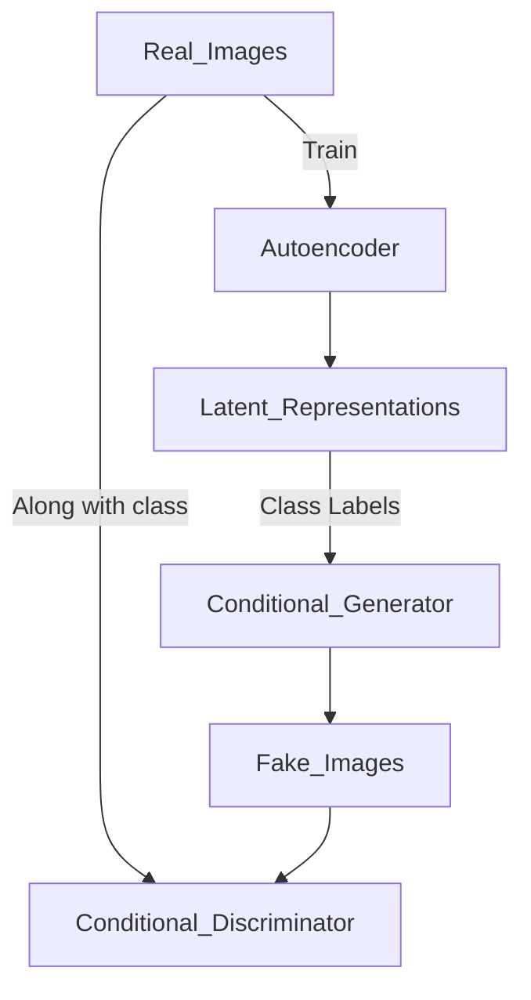

## **Balancing GAN (BAGAN)**

---

### **Overview**

**Balancing GAN (BAGAN)** is a **class-conditional GAN** architecture specifically designed to improve data generation on **imbalanced datasets**, particularly in **image classification tasks**. It aims to generate high-quality samples **even for minority classes** by incorporating **class-conditioning** and **autoencoder pretraining**.

---

### **Problem Addressed**

| Imbalanced Dataset Issue           | Explanation                                         |
| ---------------------------------- | --------------------------------------------------- |
| **Poor minority class generation** | GANs tend to favor majority classes during training |
| **Mode collapse for rare classes** | Generator focuses on frequent modes                 |
| **Biased discriminator**           | Discriminator becomes skewed due to class imbalance |

---

### **Key Components of BAGAN**

| Component                  | Description                                                                   |
| -------------------------- | ----------------------------------------------------------------------------- |
| **Autoencoder**            | Pretrained to learn a good latent representation of real data                 |
| **Conditional GAN**        | Generator and discriminator are both conditioned on class labels              |
| **Latent space alignment** | The autoencoder helps align latent codes with class-specific regions          |
| **Balanced Sampling**      | During training, latent vectors are sampled per class to ensure class balance |

---

### **Architecture Overview**

---

### **Training Procedure**

1. **Train an Autoencoder** to learn a compressed latent space for all classes.
2. Use the autoencoder to **encode class-wise samples** into the latent space.
3. Train the **Conditional GAN** using:

   * **Latent vector + class label** as generator input.
   * **Image + class label** as discriminator input.
4. Generate samples for underrepresented classes using their latent distributions.

---

### **Advantages of BAGAN**

| Advantage                               | Impact                                                                  |
| --------------------------------------- | ----------------------------------------------------------------------- |
| **Handles class imbalance**             | Balanced training across classes via latent vector sampling             |
| **Better minority class synthesis**     | Generates realistic and diverse samples for rare classes                |
| **Improved classification performance** | Augmented samples boost classifier generalization                       |
| **Works well with few samples**         | Leverages latent space and conditioning to generalize from few examples |

---

### **Loss Functions**

Uses **standard GAN losses** for conditional GANs:

* **Generator Loss**:

  $$
  \mathcal{L}_G = - \mathbb{E}_{z, y}[\log D(G(z, y), y)]
  $$

* **Discriminator Loss**:

  $$
  \mathcal{L}_D = - \mathbb{E}_{x, y}[\log D(x, y)] - \mathbb{E}_{z, y}[\log(1 - D(G(z, y), y))]
  $$

---

### **BAGAN vs Other Techniques**

| Method          | Works on Imbalance | Uses Autoencoder | Class Conditioning | Target                 |
| --------------- | ------------------ | ---------------- | ------------------ | ---------------------- |
| **GAN**         | ❌                  | ❌                | ❌                  | General                |
| **CGAN**        | ⚠️ (partially)     | ❌                | ✅                  | Balanced sets          |
| **BAGAN**       | ✅                  | ✅                | ✅                  | Imbalanced sets        |
| **SMOTE + GAN** | ⚠️                 | ❌                | ⚠️                 | Tabular/limited images |

---

### **Applications**

* Medical imaging (rare disease class augmentation)
* Fault detection (rare fault class generation)
* Face recognition (under-represented ethnic groups)
* Wildlife monitoring (rare species image generation)

---

### **Limitations**

| Limitation                             | Impact                                             |
| -------------------------------------- | -------------------------------------------------- |
| **Autoencoder bottleneck**             | Quality depends on how well the autoencoder learns |
| **Class imbalance during pretraining** | Can still affect initial latent quality            |
| **Not fully plug-and-play**            | Needs tuning and separate pretraining              |

---
