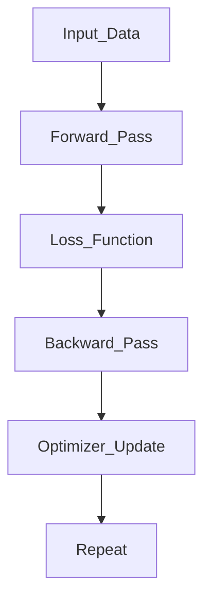

## **Training Process in Deep Learning**

---

### **Definition**

The **training process** in deep learning is the iterative adjustment of neural network parameters (weights and biases) using large data and optimization techniques to minimize the **loss function** via **backpropagation** and **gradient descent**.

---

### **Main Phases**

| Phase                | Description                                                 |
| -------------------- | ----------------------------------------------------------- |
| **Initialization**   | Set weights and biases (random or heuristic initialization) |
| **Forward Pass**     | Compute output using activations layer by layer             |
| **Loss Calculation** | Use a loss function to measure prediction error             |
| **Backward Pass**    | Apply backpropagation to compute gradients                  |
| **Optimization**     | Update weights using optimizers like Adam, SGD              |
| **Iteration**        | Repeat process for each batch, across many epochs           |

---

### **Training Pipeline Diagram**

---

### **Core Components in DL Training**

| Component                | Role                                                |
| ------------------------ | --------------------------------------------------- |
| **Neural Network**       | Sequence of layers transforming input to output     |
| **Activation Functions** | Introduce non-linearity (ReLU, Sigmoid, Tanh)       |
| **Loss Function**        | Quantifies error (Cross-Entropy, MSE)               |
| **Backpropagation**      | Chain rule-based gradient computation               |
| **Optimizer**            | Updates weights to reduce loss (Adam, SGD, RMSProp) |
| **Epoch**                | One full pass through training data                 |
| **Batch Size**           | Number of samples per gradient update               |
| **Learning Rate**        | Size of the step during optimization                |

---

### **Forward Pass**

* Computes predictions by passing data through all layers.
* Applies weights, biases, and activation functions.
* Ends with output (e.g., logits, probabilities).

---

### **Loss Function**

* Calculates error between predicted and actual values.
* Common choices:

  * **CrossEntropyLoss** (Classification)
  * **MSELoss** (Regression)
  * **CTC Loss**, **Triplet Loss** (for special tasks)

---

### **Backward Pass**

* Uses **backpropagation** to calculate gradients of loss w\.r.t. weights.
* Employs the **chain rule** layer-by-layer in reverse.
* Gradients flow from output layer to input layer.

---

### **Optimization Step**

* Uses gradients to update model weights.
* Common optimizers:

  * **SGD**, **Momentum**, **Adam**, **Nadam**, **Lion**
* May include:

  * **Learning Rate Decay**
  * **Gradient Clipping**
  * **Weight Decay (L2 Regularization)**

---

### **Training Strategies**

| Strategy                | Purpose                                            |
| ----------------------- | -------------------------------------------------- |
| **Dropout**             | Prevents overfitting by randomly disabling neurons |
| **Batch Normalization** | Stabilizes and speeds up training                  |
| **Early Stopping**      | Stops training once validation loss increases      |
| **Transfer Learning**   | Use pretrained models for faster convergence       |

---

### **Monitoring Metrics**

| Metric              | Description                          |
| ------------------- | ------------------------------------ |
| **Training Loss**   | Indicates learning progress          |
| **Validation Loss** | Monitors generalization              |
| **Accuracy**        | Task-specific correctness measure    |
| **Gradient Norms**  | Detect vanishing/exploding gradients |
| **Learning Rate**   | Check scheduler performance          |

---

### **Common Challenges**

| Challenge               | Cause                                     | Solution                             |
| ----------------------- | ----------------------------------------- | ------------------------------------ |
| **Overfitting**         | Too complex model on small data           | Dropout, L2 regularization, data aug |
| **Underfitting**        | Too simple model or insufficient training | Use deeper model, train longer       |
| **Vanishing Gradients** | Sigmoid/Tanh in deep networks             | Use ReLU, residual connections       |
| **Exploding Gradients** | Large updates                             | Gradient clipping, weight init, BN   |

---

### **Best Practices**

* Use **mini-batch gradient descent** (not full-batch or online).
* Start with **Adam optimizer**, then fine-tune with **SGD + Momentum**.
* Normalize inputs and use **batch normalization** layers.
* Use **dropout** for large fully connected layers.
* Always shuffle data per epoch (except in time series tasks).
* Use **early stopping** based on validation loss.

---
